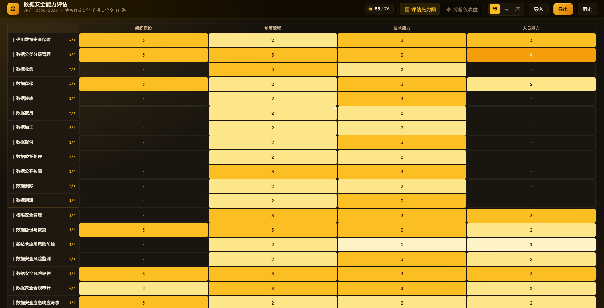
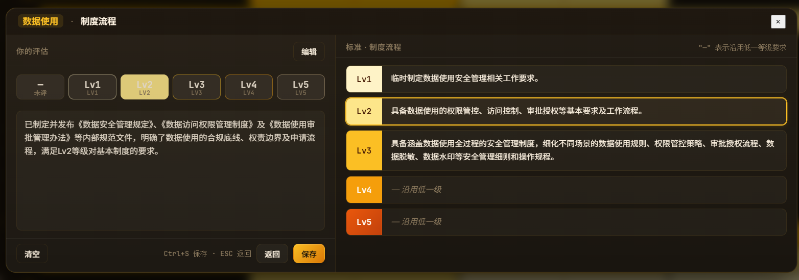
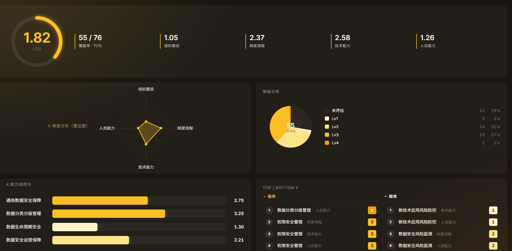

# 🛡️ datasec-suite

### 中文数据安全能力评估 · 桌面端工具集

**单文件 exe · 无需安装 · 离线可用**

[English](#english) · [快速开始](#快速开始) · [架构](#架构) · [路线图](#路线图)

---

<p align="center">
  
</p>

<p align="center"><strong>4 能力域 / 19 子域 × 4 维度 · 5 级等级评定 · 一屏总览</strong></p>

> ⚠️ **当前状态：重度开发中，暂无稳定版。** 公开源码仅供评估反馈，请勿分发或用于生产环境。稳定版会打 tag 公布。

---

## 🎯 核心功能

### 1️⃣ 评估热力图 · 一屏总览能力全景

<p align="center">
  
</p>

- **19 个能力子域 × 4 个评估维度** = 76 个能力单元
- **5 级等级评定**（未评 / Lv1 / Lv2 / Lv3 / Lv4 / Lv5）
- 颜色深浅直接反映成熟度——一眼看到短板
- 进度条 `55/76` 实时显示覆盖率
- 4 能力域用 Y 轴色条区分：通用数据安全保障（黄）/ 数据生命周期安全（粉）/ 数据生命周期安全续（绿/青）/ 数据安全运营管理（蓝）

---

### 2️⃣ 详情浮窗 · 点击格子查看标准 + 编辑评估

<p align="center">
  
</p>

**双栏布局 · 左评估 / 右标准 · 默认只读，点编辑进编辑态**

- **左栏（你的评估）**：6 个等级按钮（未评 / Lv1-Lv5）+ 大文本框填写本机构实际做法、可量化指标、佐证材料
- **右栏（标准）**：当前子域在该维度的 5 级标准描述——按你已选等级高亮
- **沿用低一级**：右栏 `Lv4/Lv5` 显示"— 沿用低一级"——对应 PDF 第 5.1 节 a 条
- **专项双继承**：hover 右栏 dash 块 → 弹窗显示通用 sub 同等级要求（PDF 5.1 节 b 条）
- **离开确认**：编辑未保存时点 × / 切 cell / 切标准 → 弹"是否保存"模态框（保存 / 不保存 / 取消）

---

### 3️⃣ 分析仪表盘 · 评分 + 雷达 + 等级分布 + 能力域 + TOP/BOTTOM

<p align="center">
  
</p>

- **总评分环**（左上）：当前综合分 + 覆盖率，弧形进度
- **4 维度分**（顶部）：组织建设 / 制度流程 / 技术能力 / 人员能力 的平均分
- **雷达图**（左下）：4 维度分雷达图——一眼看出哪个维度短板
- **等级分布饼图**（右上）：已评估格子在 5 个等级上的分布——评估结构是否健康
- **4 能力域得分条形图**（左下）：通用 / 分类分级 / 生命周期 / 运营 的平均分横向对比
- **TOP/BOTTOM 5**（右下）：评估最强 5 项 vs 最弱 5 项——精准定位优先级

---

## 📚 当前已支持标准

| 标准号 | 名称 | 发布机构 | 状态 |
|---|---|---|---|
| **JR/T 0358-2026** | 金融数据安全 · 数据安全能力体系 | 中国人民银行 | ✅ v0.1+ 内置 |
| **GB/T 37988-2019** | 信息安全技术 · 数据安全能力成熟度模型（DSMM） | 国家标准化管理委员会 | ✅ v0.2+ 内置（30 PA × 5 级 × 4 维） |

> 多标准架构：每个标准独立的 `standards.<id>.json` + `assessment.<id>.json` + `history/<id>/`，**数据完全隔离**，可在工具栏下拉切换。

---

## ✨ 核心特性

- 📊 **能力评估热力图**：4 能力域 / 19 子域 × 4 维度，5 级等级评定——一屏总览
- 📝 **机构描述编辑**：点格子 → 弹详情浮窗 → 选等级 + 填本机构实际做法、可量化指标、佐证材料
- 📑 **标准联动**：详情浮窗右栏自动显示 5 级标准，按你已选等级高亮——避免"凭感觉打分"
- 🧬 **PDF 双继承规则**：
  - **a)** "—" 沿用低一等级（同能力域同维度）
  - **b)** 专项能力 "—" = 通用同等级 **+** 专项低一等级（hover 即可查看通用同等级内容）
- 📈 **分析仪表盘**：总评分 + 4 维度分 + 雷达图 + 等级分布 + 4 能力域得分 + TOP/BOTTOM 5
- 🎨 **三套主题**：暖（琥珀）/ 青（极光）/ 海（星海）—— 同色系渐变 + 玻璃态
- 📤 **导出只读 HTML**：内联 CSS + JS，**保留所有交互**（hover 气泡 / 主题切换 / 详情浮窗），只去掉编辑入口
- 📥 **导入 HTML 报告**：拿到别人发的导出 HTML → 一键导入，对方数据立刻变你的当前数据
- 🕓 **历史快照**：每次保存自动 snapshot 到 `data/history/`，可一键还原任意历史版本
- 📦 **单 exe 发布**：标准数据 embed 进二进制，双击即可使用，**无任何外部依赖**

---

## 🚀 快速开始

### 📥 下载

> **暂无稳定版。** 见顶部状态说明。

稳定版发布后，Windows 二进制为单文件 (~9.4 MB)：
```
datasec-suite-app.exe
```

### 🔨 从源码构建

需要 **Go 1.22+**、**Node 18+**、**Wails v2** CLI。

```powershell
# 安装 Wails CLI（一次性）
go install github.com/wailsapp/wails/v2/cmd/wails@latest

# 克隆 + 构建
git clone https://github.com/weishengsuptp/datasec-suite.git
cd datasec-suite
wails build
# → build/bin/datasec-suite-app.exe
```

### 🛠️ 开发模式

```powershell
wails dev   # 热重载前端，Go 改动自动 rebuild
```

---

## 🏗️ 架构

```
┌─────────────────────────────────────────────────────────┐
│            datasec-suite-app.exe (single binary)        │
├─────────────────────────────────────────────────────────┤
│  Go backend (Wails v2)                                  │
│  ├── App bindings: GetStandards / SaveAssessment /      │
│  │   ImportHTML / ExportHTML / ListHistory / Restore    │
│  ├── Embed: frontend/dist/* (HTML + CSS + JS)           │
│  └── Embed: data/standards.<id>.json (按标准多文件)      │
├─────────────────────────────────────────────────────────┤
│  WebView2 frontend                                      │
│  ├── Heatmap grid (CSS Grid, 19×4 = 76 cells)           │
│  ├── Detail view (floating card, 5fr/7fr grid)          │
│  ├── Dashboard (SVG radar + pie + bars)                 │
│  ├── Theme switcher (warm / cool / deep)                │
│  └── Toolbar (import / export / history)                │
└─────────────────────────────────────────────────────────┘

data/                            (created at first run)
├── standards.jrt0358.json       ← 答案库（per-standard）
├── standards.gbt37988.json      ← 答案库（per-standard）
├── assessment.jrt0358.json      ← 当前评估（per-standard）
├── assessment.gbt37988.json
├── history/                     ← 自动快照（per-standard/<id>/）
└── exports/                     ← 导出的 HTML 报告
```

### 关键设计

1. **单 exe 分发** — `//go:embed data/standards.*.json` 把答案库打进二进制。用户**只需**一个 `.exe`，无任何外部依赖。
2. **保存前快照** — `saveAssessment` 写新文件前自动把旧文件 snapshot 到 `data/history/<id>/`，可一键还原。
3. **多标准隔离** — 每个标准独立一份 `standards.<id>.json` + `assessment.<id>.json` + `history/<id>/`，**绝不共享数据**。
4. **导出 = 分享状态** — 导出的 HTML 保留所有交互，reviewer 可以 hover 看描述、切主题、点格子看详情——但编辑入口去掉。

---

## 🗺️ 路线图

- [x] **v0.1** — JR/T 0358-2026 评估器（热力图 + 详情浮窗 + 历史 + 导出 + 导入）
- [x] **v0.2** — GB/T 37988-2019 (DSMM) 多标准架构（30 PA × 5 级 × 4 维）
- [x] **v0.3** — 详情浮窗重构 + 分析仪表盘 + 视觉优化
- [ ] **v0.4** — 自定义维度/等级权重
- [ ] **v0.5** — 跨标准对比报告

稳定版只在每个 milestone 真正成熟后才打 tag。

---

## 🤝 参与贡献

Issues 和 PRs 欢迎。详见 [CONTRIBUTING.md](./CONTRIBUTING.md)（待写）。

## 📄 许可

[Apache License 2.0](./LICENSE)

## 🙏 致谢

- **标准数据**：JR/T 0358-2026《金融数据安全 数据安全能力体系》（中国人民银行）· GB/T 37988-2019《信息安全技术 数据安全能力成熟度模型》（国家标准化管理委员会）
- **框架**：[Wails v2](https://wails.io)（Go + WebView2）

---

<a id="english"></a>

## English

**datasec-suite** is a self-contained desktop evaluator for Chinese data-security capability standards. Built with **Wails (Go + WebView2)**, it runs as a **single `.exe`** — no installer, no database, no network.

### Currently Supported Standards

| Standard | Title | Issuer | Status |
|---|---|---|---|
| **JR/T 0358-2026** | Financial Data Security — Data Security Capability System | People's Bank of China | ✅ Built into v0.1+ |
| **GB/T 37988-2019** | Information Security Technology — Data Security Maturity Model (DSMM) | SAC | ✅ Built into v0.2+ (30 PA × 5 levels × 4 dimensions) |

### Highlights

- 📊 **Capability heatmap**: 4 domains / 19 subdomains × 4 dimensions, 5 levels
- 📝 **Institution-specific notes**: click any cell → floating detail view → pick level + record your org's actual practices
- 📑 **Reference panel**: PDF 5.1 § "—" dual-inheritance rules visualized
- 🧬 **Dual inheritance (PDF §5.1.b)**: for specialized subdomains, "—" = same-level general **+** lower-level specialized; hover the dashed cell to see the general-level content
- 📈 **Analytics dashboard**: total score + 4-dimension radar + level distribution pie + 4-domain bar chart + TOP/BOTTOM 5
- 🎨 **Three themes**: warm / cool / deep
- 📤 **Read-only HTML export**: inlines CSS + JS, **keeps all interactions** (hover bubbles, theme switcher, detail view), removes only edit affordances
- 📥 **HTML import**: load someone else's exported report → their data instantly becomes yours
- 🕓 **History snapshots**: auto-snapshot on every save, one-click rollback
- 📦 **Single-exe distribution**: standards JSON embedded in the binary — double-click and run
