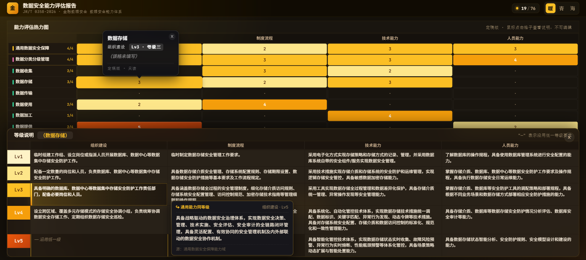
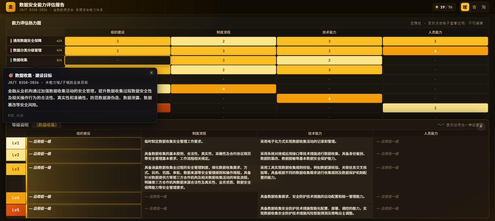
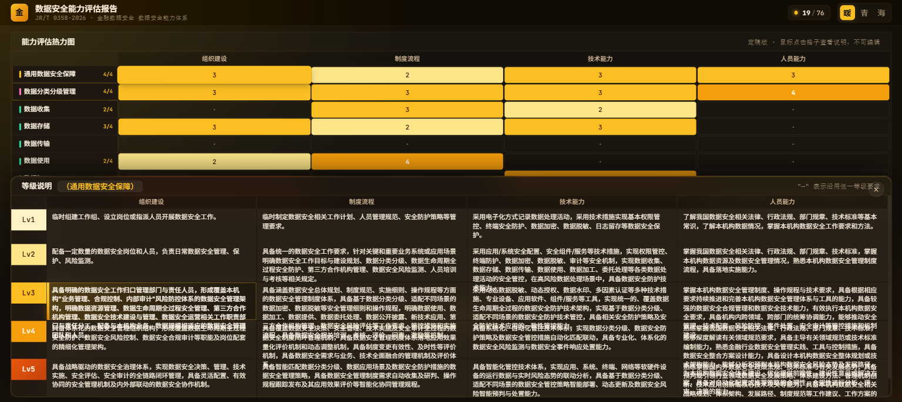

# datasec-suite · 数据安全能力评估工具集

> **A self-contained desktop evaluator for Chinese data-security capability standards — single exe, no installer, no dependencies.**

[](./LICENSE)
[](https://go.dev)
[](https://wails.io)
[](https://www.microsoft.com/windows)

> ⚠️ **Status: under heavy development. No stable release yet.**
> The code is shared publicly for transparency, but please do **not** distribute or rely on this as a finished product. Use only for evaluation and feedback. Stable releases will be tagged when the project is ready.



<table>
  <tr>
    <td></td>
    <td></td>
  </tr>
  <tr>
    <td align="center"><sub>子域名 → PDF 建设目标气泡</sub></td>
    <td align="center"><sub>暖色主题 · 玻璃态视觉</sub></td>
  </tr>
</table>

---

## 中文简介

**datasec-suite** 是一款面向中文数据安全能力标准的桌面评估工具集。基于 **Wails (Go + WebView2)** 框架，**单个 exe 文件即可运行**——无需安装、无需数据库、无需联网。

### 当前已支持标准

| 标准号 | 名称 | 发布机构 | 状态 |
|---|---|---|---|
| **JR/T 0358-2026** | 金融数据安全 数据安全能力体系 | 中国人民银行 | ✅ v0.1 内置 |
| **GB/T 37988-2019** | 信息安全技术 数据安全能力成熟度模型（DSMM） | 国家标准化管理委员会 | 🔜 规划中 |

### 核心特性

- 📊 **能力评估热力图**：4 能力域 / 19 子域 × 4 维度（组织建设 / 制度流程 / 技术能力 / 人员能力），5 级等级评定
- 📝 **机构描述编辑**：双击格子填写本机构实际做法、可量化指标、佐证材料
- 📑 **等级说明联动**：选中格子 → 下方浮窗显示该子域 4×5 = 20 个标准描述单元（PDF 第 5.1 节）
- 🧬 **PDF 双继承规则**：
  - **a)** "—" 沿用低一等级（同能力域同维度）
  - **b)** 专项能力 "—" = 通用同等级 **+** 专项低一等级（hover 即可查看通用同等级内容）
- 🎨 **三套主题**：暖（琥珀）/ 青（极光）/ 海（星海）—— 同色系渐变 + 玻璃态
- 📤 **导出只读 HTML**：内联 CSS + JS，**保留所有交互**（hover 气泡 / 主题切换 / 浮动面板），只去掉编辑入口
- 📥 **导入 HTML 报告**：拿到别人发的导出 HTML → 一键导入，对方数据立刻变你的当前数据
- 🕓 **历史快照**：每次保存自动 snapshot 到 `data/history/`，可一键还原任意历史版本
- 📦 **单 exe 发布**：标准数据 embed 进二进制，双击即可使用，**无任何外部依赖**

---

## English

**datasec-suite** is a self-contained desktop evaluator for Chinese data-security capability standards. Built with **Wails (Go + WebView2)**, it runs as a **single `.exe`** — no installer, no database, no network.

### Currently Supported Standards

| Standard | Title | Issuer | Status |
|---|---|---|---|
| **JR/T 0358-2026** | Financial Data Security — Data Security Capability System | People's Bank of China | ✅ Built into v0.1 |
| **GB/T 37988-2019** | Information Security Technology — Data Security Maturity Model (DSMM) | SAC | 🔜 Planned |

### Highlights

- 📊 **Capability heatmap**: 4 domains / 19 subdomains × 4 dimensions, 5 levels
- 📝 **Institution-specific notes**: double-click any cell to record your org's actual practices, metrics, and evidence
- 📑 **Reference panel**: PDF 5.1 § "—" dual-inheritance rules visualized
- 🧬 **Dual inheritance (PDF §5.1.b)**: for specialized subdomains, "—" = same-level general **+** lower-level specialized; hover the dashed cell to see the general-level content
- 🎨 **Three themes**: warm / cool / deep
- 📤 **Read-only HTML export**: inlines CSS + JS, **keeps all interactions** (hover bubbles, theme switcher, floating panel), removes only edit affordances
- 📥 **HTML import**: load someone else's exported report → their data instantly becomes yours
- 🕓 **History snapshots**: auto-snapshot on every save, one-click rollback
- 📦 **Single-exe distribution**: standards JSON embedded in the binary — double-click and run

---

## Quick Start / 快速开始

### Download / 下载

> **No release yet.** See status notice at the top of this README.

When a stable release is published, the Windows binary will be a single file (~8.8 MB):
```
datasec-suite-app.exe
```

### Build from Source / 从源码构建

Requires **Go 1.22+**, **Node 18+**, **Wails v2** CLI.

```powershell
# install Wails CLI (one-time)
go install github.com/wailsapp/wails/v2/cmd/wails@latest

# clone + build
git clone https://github.com/weishengsuptp/datasec-suite.git
cd datasec-suite
wails build
# → build/bin/datasec-suite-app.exe
```

### Development Mode / 开发模式

```powershell
wails dev   # hot-reload frontend, Go rebuilds on save
```

---

## Architecture / 架构

```
┌─────────────────────────────────────────────────────────┐
│            datasec-suite-app.exe (single binary)        │
├─────────────────────────────────────────────────────────┤
│  Go backend (Wails v2)                                  │
│  ├── App bindings: GetStandards / SaveAssessment /      │
│  │   ImportHTML / ExportHTML / ListHistory / Restore    │
│  ├── Embed: frontend/dist/* (HTML + CSS + JS)           │
│  └── Embed: data/standards.json (JR/T 0358-2026 答案库) │
├─────────────────────────────────────────────────────────┤
│  WebView2 frontend                                      │
│  ├── Heatmap grid (CSS Grid)                            │
│  ├── Floating reference panel                           │
│  ├── Bubble (hover / pinned / edit states)              │
│  ├── Theme switcher (warm / cool / deep)                │
│  └── Toolbar (import / export / history)                │
└─────────────────────────────────────────────────────────┘

data/                            (created at first run)
├── assessment.json              ← your current evaluation
├── history/                     ← auto-snapshots (rollback)
└── exports/                     ← your exported HTML reports
```

### Key Design Decisions / 关键设计

1. **Single-exe distribution** — standards JSON is `//go:embed`-ed at compile time. End users need **only** the `.exe`. No `data/standards.json` to ship.
2. **Snapshot before save** — `saveAssessment` copies the previous file into `data/history/` before overwriting. Users can roll back from the history modal.
3. **Export = share state, not just data** — the exported HTML keeps all interactivity so reviewers can explore the full grid (hover for descriptions, switch themes, open the reference panel). Edit affordances are stripped.
4. **Import = swap state** — loading someone else's exported HTML overwrites the current assessment. The previous state is preserved via the auto-snapshot.

---

## Roadmap / 路线图

- [ ] **v0.1** — JR/T 0358-2026 evaluator (heatmap + notes + history + export + import) — _internal development, not released_
- [ ] **v0.2** — GB/T 37988-2019 (DSMM) support
- [ ] **v0.3** — Multi-standard architecture (hot-swap standards at runtime)
- [ ] **v0.4** — Custom dimension/level weighting
- [ ] **v0.5** — Cross-standard comparison reports

Stable releases will only be tagged when each milestone is genuinely ready for external use.

---

## Contributing / 参与贡献

Issues and PRs welcome. See [CONTRIBUTING.md](./CONTRIBUTING.md) (TBD).

## License / 许可

[Apache License 2.0](./LICENSE)

## Credits / 致谢

- **Standards data**: JR/T 0358-2026《金融数据安全 数据安全能力体系》(中国人民银行)
- **Framework**: [Wails v2](https://wails.io) (Go + WebView2)